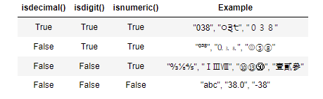

# 데이터 구조(Data Structure)

## 순서가 있는 데이터 구조

### 문자열

#### 조회/탐색

- .find(x): x의 **첫번째 위치를 반환**, **<u>x가 없다면 `-1`을 반환</u>**

  ``````python
  a = 'apple'
  a.find('p')
  1 => apple[1]
  ``````

- index(x): x의 첫번째 위치를 반환, **<u>x가 없다면 오류발생</u>**

- .startswith(x): 문자열이 x로 시작하면 True, 아니면 False 

- .endswith(x): 문자열이 x로 끝나면 True, 아니면 False

  ``````python
  # 문자열 분할보다 startswith, endswith 권장
  # Correct:
  if foo.startswith('bar'):
  # Wrong:
  if foo[:3] == 'bar'
  ``````

- 기타 문자열 관련 검증 메서드

  - .isalpha(): 글자로 이루어져 있는가? (숫자X)

  - .isspace(): 공백으로 이루어져 있는가?

  - .isupper(): 대문자로 이루어져 있는가?

  - .islower(): 소문자로 이루어져 있는가?

  - .istitle(): 타이틀 형식으로 이루어져 있는가?

    => <u>이것들만</u>으로 이루어져 있어야 True 반환

- 숫자 판별 메서드
  - .isdecimal(): 문자열이 <u>0~9까지의 수</u>로 이루어져 있는가?
  - .isdigit(): 문자열이 <u>숫자</u>로 이루어져 있는가?
  - .isnumeric(): 문자열이 <u>수</u>로 볼 수 있는가?

​	

#### 문자열 변경

- .replace(old, new[, count]): 바꿀 대상 글자를 새로운 글자로 반환, count를 지정하면 해당 갯수만 시행

- .strip([chars]): parameter를 지정하지 않으면 공백 제거

  - strip: 양쪽 제거
  - lstrip: 왼쪽 제거
  - rstrip: 오른쪽 제거

- .split([chars]): 문자열을 특정한 단위로 나누어 **리스트로 반환**

- 'spearator'.join(iterable): 구분자를 이어 붙인 문자열 반환

  ``````python
  word = '배고파'
  '!'.join(word) = '배!고!파'
  ``````

- capitalize(): 앞글자 대문자로 만들어 반환

- .title: `'`나 공백 이후를 대문자로 만들어 반환

- .upper(): 모두 대문자

- .lower(): 모두 소문자
- .swapcase(): 대<->소문자 변경

#### 문자열 메서드 모두 확인

dir('string') = [모두 나옴]


### 리스트(List)

#### 값 추가 및 삭제 (원본 변경)

- .append(x): 리스트에 값 추가
- .extend(iterable): iterable 값 추가 (순회하면서 추가)
- .insert(i, x): 정해진 위치 i에 값 추가 (i = 인덱스)
- .remove(x): 리스트에서 **값이 x인 첫번째 항목** 삭제 (없으면 **ValueError**)
- .pop([i])  
  - 정해진 위치 i에 있는 값을 삭제하며, 그 항목을 반환 (**삭제되는 값을 return**)
  - i가 지정되지 않으면 마지막 항목을 삭제하고 되돌려줌
- .clear(): 리스트의 모든 항목 삭제

#### 탐색 및 정렬

- .index(x) : x값을 찾아 해당 **index값을 반환**
- .count(x): 원하는 값의 개수를 반환
- .sort(): 리스트를 정렬
  - 내장함수 sorted()와 다르게 **원본 list를 변형**, **None을 리턴**
  - parameter로는 key와 reverse가 있음
- .reverse(): 리스트의 요소들을 반대로 뒤집음
  - 정렬하는 것이 아닌 원본 순서를 뒤집고 수정
  - 내장함수 reversed()와는 다르게 원본 list 변형, none을 리턴

#### 리스트 메서드 모두 확인

dir(list) = [모두 나옴]


### 튜플(tuple)

값을 변경할 수 없기 때문에 **값에 영향을 미치지 않는 메서드만 지원**

#### 탐색

- .index(x[, start[, end]]) 
  - 튜플에 있는 항목 중 값이 x와 같은 첫번째 인덱스를 돌려줌
  - 해당하는 값이 없으면, ValueError 발생
- .count(x): 튜플에서 x가 등장하는 횟수 반환


## 순서가 없는 데이터 구조

### 셋(set)

#### 추가 및 삭제

- add(elem): elem을 셋에 추가
- .update(*others): 어러 값을 추가, 반드시 iterable 데이터 구조 전달
- .remove(elem): elem을 셋에서 삭제, elem이 없으면 keyError 발생
- .discard(elem): elem을 셋에서 삭제, elem이 없어도 에러 발생X

### 딕셔너리

#### 조회

- .get(key[, default]): key를 통해 value를 가져옴
  - **key가 없을 경우 None반환(error X)**
  - dict[key] => error 발생
- .setdefault(key[, default])
  - .get()과 비슷하게 key가 딕셔너리에 있으면 value 반환
  - get과 다른점은 key가 딕셔너리에 없을 경우, default값을 갖는 key를 삽입 후 default 반환
  - 만일 default가 없을 경우 None을 돌려줌
- .items(): key와 value 값 반환

#### 추가 및 삭제

- .pop(key[, default])
  - key가 딕셔너리에 있으면 제거하고 그 값을 돌려줌, 그렇지 않으면 default 반환
  - default가 없는 상태에서 key가 딕셔너리에 없는 경우 KeyError

- .update([other])
  - other가 제공하는 key,value 쌍을 추가
  - other는 다른 딕셔너리나 key/value 쌍으로 되어있는 모든 iterable 사용 가능

## 얕은 복사와 깊은 복사

### 데이터 분류

#### 변경 불가능한 데이터

- 리터럴
  - 숫자
  - 글자
  - 참/거짓
- range()
- tuple()
- frozenset()

#### 변경 가능한 데이터

- list
- dict
- set

### 복사 방법

#### 할당

- 할당은 할당연산자(=)를 사용하여 저장
- 변수만 복사하다 보니 바라보는 객체는 당연히 동일
- => 두 개 중  **하나만 변경되어도 나머지 하나도 수정**

#### 얕은 복사(Shallow copy)

##### slice 연산자 사용

- Slice([:]) 연산자 사용
- 새로운 id가 부여되며, **서로 영향을 받지 않음**

##### list() 활용

- 리스트를 list함수를 이용하여 복사, 저장
- 서로 영향을 받지 않음

But, 2차원 리스트와 같이 mutable 객체 안에 mutable 객체가 있는 경우 id는 다르지만 내부 값은 영향을 받음

#### 깊은 복사

- 깊은 복사는 새로운 객체를 만들고, 원본 객체 내에 있는 객체에 대한 복사를 재귀적으로 삽입
- 내부에 있는 모든 객체까지 새롭게 값이 변경

- copy 모듈을 활용