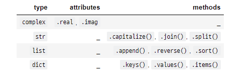

# OOP (Object Oriented Programming)

## 객체 (Object)

- 파이선의 **모든 것은 객체**이다

- 모든 객체는 **타입(type), 속성(attribute), 조작법(method)**을 가진다
- 객체의 특징
  - 타입: 어떤 연산자와 조작이 가능한가?
  - 속성: 어떤 상태(데이터)를 가지는가?
  - 조작법: 어떤 행위(함수)를 할 수 있는가?


## 객체 지향 프로그래밍

객체가 중심이 되는 프로그래밍

: 컴퓨터 프로그램을 명령어의 목록으로 보는 시각에서 벗어나 '객체'들의 모임으로 파악

객체 중심의 장점
- 코드의 **직관성**
- 활용의 **용이성**
- 변경의 **유연성**

## OOP기초

### 기본 문법

``````python
# 클래스 정의
class MyClass:
    pass

# 인스턴스 생성
my_instance = MyClass()

# 속성 접근
my_instance.my_attribute

# 메서드 호출
my_instance.my_method()
``````

- 클래스 : 공통된 속성과 조작법을 가진 객체들의 분류
- 인스턴스 
  - 특정 클래스의 실제 데이터 예시
  - 모든 객체는 **특정 클래스의 인스턴스**

### 속성과 메서드



- **속성** : 객체의 **상태 / 데이터**
- **메서드** : 특정 객체가 **할 수 있는 행위**

### 인스턴스

- 정의된 클래스에 속하는 객체를 해당 클래스의 인스턴스
- `Person` 클래스의 인스턴스는 `Person()`을 호출함으로써 생성
- `type()` 함수를 통해 객체의 클래스 확인
- `person1 = Person()` => 인스턴스 생성

#### 인스턴스 변수

- 인스턴스의 속성
- 각 인스턴스들의 고유한 데이터
- 생성자 메서드에서 `self.변수명`로 정의
- 인스턴스가 생성된 이후 `인스턴스.변수명` 으로 접근 및 할당

``````python
class Person:
    pass
p1 = Person()
p1.name = 'jack'
p1.age = 25
``````

#### 인스턴스 메서드

- 인스턴스가 사용할 메서드
- 클래스 내부에 정의되는 메서드는 기본적으로 인스턴스 메서드로 생성
- 메서드 호출시 첫번째 인자로 `self`가 전달

``````python
class Myclass:
    def instance_methond(self, arg1, arg2, ...):
        ...
my_instance = Myclass()
my_instance.instance_method(arg1, arg2, ..)
``````

- 메서드도 함수이기 때문에 추가적인 인자 받을 수 있음

#### Self

- 인스턴스 자신
- 인스턴스 메서드는 호출 시 첫번째 인자로 인스턴스 자신이 전달
- 매개변수명으로 `self`를 첫번째 인자로 정의 (다른 이름도 가능하나 추천X)

#### 생성자 메서드

- **인스턴스 객체가 생성**될 때 **자동으로 호출**되는 함수
- 반드시 `__init__`이라는 이름으로 정의

#### 소멸자 메서드

- 인스턴스 객체가 소멸되기 직전에 자동으로 호출되는 함수
- 반드시 `__del__`이라는 이름으로 정의

#### 속성 정의

- 특정 데이터 타입(또는 클래스)의 객체들이 가지게 될 상태/데이터
- self.<속성명> = 값 or <인스턴스>.<속성명> = <값>

#### 매직(스페셜) 메서드

- 더블언더스코어(__)가 있는 메서드는 특별한 일을 하기 위한 메서드

``````python
'__str__(self)', => 특정 객체를 출력할 때 보여줄 내용 정의
'__len__(self)',
'__repr__(self)',
'__lt__(self, other)',
'__le__(self, other)',
'__eq__(self, other)',
'__ne__(self, other)',
'__gt__(self, other)',
'__ge__(self, other)',
``````

### 클래스

#### 클래스 생성

- class 키워드와 <클래스의 이름>으로 가능
- <클래스의 이름>은 PascalCase(첫 **단어**를 대문자로 시작)
- 클래스 내부에는 데이터와 함수 정의 가능
- => 데이터는 속성 정의된 함수는 메서드로 부름

#### 클래스 변수

- 클래스의 속성
- 모든 인스턴스가 공유
- 클래스 선언 내부에서 정의
- `클래스.변수명` 으로 접근 및 할당

#### 클래스 메서드

- 클래스가 사용할 메서드
- `@classmethod` 데코레이터를 사용하여 정의
- 메서드 호출 시, 첫번째 인자로 클래스 `cls`가 전달

#### 스태틱 메서드(정적 메서드)

- 클래스가 사용할 메서드
- 인스턴스와 클래스의 속성과 무관한 메서드
- `@staticmethod` 데코레이터를 사용하여 정의
- **호출시, 어떠한 인자도 전달되지 않음**
- 속성을 다루지 않고 단지 기능(행동)만을 하는 메서드를 정의할 때 사용

### 인스턴스와 클래스 간의 이름 공간

- 클래스를 정의하면 클래스와 해당하는 이름 공간이 생성
- 인스턴스를 만들면 인스턴스 객체가 생성되고 이름 공간이 생성
- 인스턴스에서 특정 속성에 접근하면, **인스턴스-클래스 순**으로 탐색

### 비교정리

#### 인스턴스와 메서드

- 인스턴스는 3가지 메서드(인스턴스, 클래스, 스태틱 메서드) 모두에 접근 가능
  - but 인스턴스에서 클래스 메서드와 스태틱 메서드는 호출X 
- 인스턴스가 할 행동은 모두 **인스턴스 메서드**로 한정 지어서 설계

#### 클래스와 메서드

- 클래스는 3가지 메서드(인스턴스, 클래스, 스태틱 메서드) 모두에 접근 가능
  - but 클래스에서 인스턴스 메서드는 호출X
- 클래스 자체(`cls`)와 그 속성에 접근할 필요가 있다면 **클래스 메서드**로 정의
- 클래스와 클래스 속성에 접근할 필요가 없다면 **스태틱 메서드**로 정의
  - 정적 메서드는 `cls`, `self`와 같이 묵시적인 첫번째 인자를 받지 않기 때문

#### OOP의 핵심 개념

- **추상화**

  - 세부적인 내용은 감추고 <u>필수적인 부분만 표현</u>하는 것
  - 현실 세계를 프로그램 설계에 반영하기 위해 사용
  - 여러 클래스가 공통적으로 사용할 속성 및 메서드를 추출하여 기본 클래스로 작성

- **상속**

  - 클래스의 가장 큰 특징은 `상속`이 가능하다는 것
  - <u>부모 클래스의 모든 속성이 자식 클래스에게 상속</u> 되므로 코드 재사용성 높아짐
  - issubclass(class, classinfo): class가 classinfo의 subclass인 경우 `True` 반환
  - isinstance(object, classinfo): object가 classinfo의 instance거나 subclass인 경우 `True` 반환
  - super()
    - 자식 클래스에 메서드를 추가로 구현할 수 있음
    - 부모 클래스의 내용을 사용하고자 할 때, `super()` 사용 가능

- **다형성**

  - <u>동일한 메서드가 클래스에 따라 다르게 행동</u>할 수 있음을 뜻함
  - 서로 다른 클래스에 속해있는 객체들이 동일한 메세지에 대해 각기 다른 방식으로 응답될 수 있음

- **캡슐화**

  - 객체의 일부 구현 내용에 대해 외부로부터의 직접적인 액세스를 차단
  - 파이썬에서는 암묵적으로 존재하지만, 언어적으로는 존재하지 않음
  - 접근제어자의 종류
    - Public Member
      - 언더바 없이 시작하는 메서드나 속성
      - 어디서나 호출 가능
      - 하위 클래스에서 메서드 오버라이딩 허용
      - 일반적으로 작성되는 메서드와 속성의 대다수 차지
    - Protected Member
      - 언더바 1개로 시작하는 메서드나 속성
      - 암묵적 규칙에 의해 부모 클래스 내부와 자식 클래스에서만 호출 가능
      - 하위 클래스에서 메서드 오버라이딩 허용
    - Private Member
      - 언더바 2개로 시작하는 메서드나 속성
      - 본 클래스 내부에서만 사용 가능
      - 하위 클래스 상속 및 호출이 불가능
      - 외부 호출이 불가능
  - `getter`메서드와 `setter`메서드
    - 변수에 접근할 수 있는 메서드를 별도로 생성
    - `getter` : 변수의 값을 읽는 메서드
      - @property 데코레이터 사용
    - `setter` : 변수의 값을 설정하는 성격의 메서드
      - @변수.setter 를 사용  

  - 다중 상속
    - 두개 이상의 클래스를 상속받는 경우
      - 상속 받은 모든 클래스의 요소를 활용 가능
      - 중복된 속성이나 메서드가 있는 경우 상속 순서에 의해 결정
    - 상속관계에서의 이름 공간과 MRO (Method Resolution Order)
      - 기존의 `instance->class` 순으로 이름 공간을 탐색해나가는 과정에서 상속관계에 있으면 아래와 같이 확장
        - `instance -> 자식 class -> 부모 class`
      - MRO는 <u>해당 인스턴스의 클래스가 어떤 부모 클래스를 가지는지 확인</u>하는 속성 또는 메서드